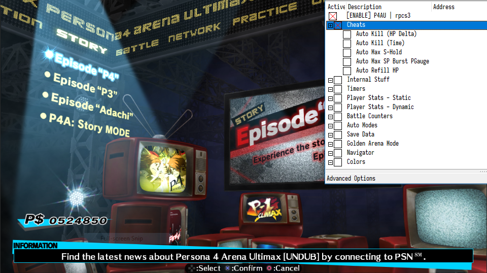

# Persona 4 Arena Ultimax Cheat Table

A cheat table for __Persona 4 Arena Ultimax__, a game developed by Atlus, for use while playing on RPCS3.

__WARNING:__ Generally untested, use at your own discretion, don't blame me for borked saves, etc.

## Prerequisites

* Latest Cheat Engine release.
* Latest RPCS3 release.
* Persona 4 Arena Ultimax - This table has been tested with:
  * `BLJM61209`, patch `1.3`
  * `BLUS31469`, patch `1.1` (undubbed)

## Installation

1. Download and install Cheat Engine (or use the portable version).
2. Clone or download this repository.

## Usage

1. Open RPCS3 and launch __Persona 4 Arena Ultimax__.
2. Open Cheat Engine and attach it to the RPCS3 process.
3. Load the `rpcs3-p4au.CT` table. If prompted, allow the main table script to run.
4. Enable the table via the `[ENABLE]` script at the top.

---

## Table Contents

Most stuff should be self-explanatory; however, some notes may be required:

### Cheats

This section contains various cheat scripts:

* __Auto Kill (HP Delta)__ - Maintains a constant difference between P1 HP and P2 HP.
  The default difference is `5500` - you can change this by editing the `hp_delta` variable at the top of the script.
* __Auto Kill (Time)__ - Automatic P2 KO after the allotted time has elapsed.
  The default time value is `3` seconds - you can change this value by editing the `seconds` variable at the top of the script.
* __Auto Max S-Hold__ - Automatically maxes out the P1 S-Hold meter.
  This allows you to perform an instant kill move by simply pressing the S-Hold button (SQUARE by default).
* __Auto Max HP Burst PGauge__ - For P1, this script will max out the SP, Persona Gauge and Burst meters.
  For P2 this script will effectively disable said meters.
* __Auto Refill HP__ - Fills up P1 HP once it falls below a certain threshold.
  The default threshold is `0.75` of P1 HP MAX - you can change this by editing the `threshold` variable at the top of the script.

### Timers

Only the `Round - Down, Ticks` and `Round - Up, Ticks` seem to have an effect in-game, with each second being 60 ticks.

### Player Stats

#### Static Stats

Being static, these are safe to freeze.

#### Dynamic Stats

These aren't allocated by the game outside of a match, therefore freezing any value under these records is __not__ recommended.

### Battle Counters

Counters for the number of rounds and matches fought in a session.
Counters beginning with `SA` are specific to score attack mode.

### Auto Modes

Flags that indicate whether the game is running in auto mode.

Freezing the `Challenge Demo Mode` to `0` and starting a challenge demonstration via the pause menu will allow you to auto complete all challenges.

### Save Data

Editing any value under this record will persist to future sessions if the game is saved after the change.

Challenge Mode and Lesson Mode have byte type completion flags - `01` means the challenge or lesson has been completed.
Golden Arena Mode, Score Attack Mode and Arcade Mode have binary completion flags, a bit set to `1` means that the course has been completed.

For Golden Arena Mode, you can check how much EXP is required for a certain character level by using the [Character Level Table](data/char_lvl.tsv), and the required amount of cleared arena floors per Navigator level in the [Navigator Level Table](data/navi_lvl.tsv).
